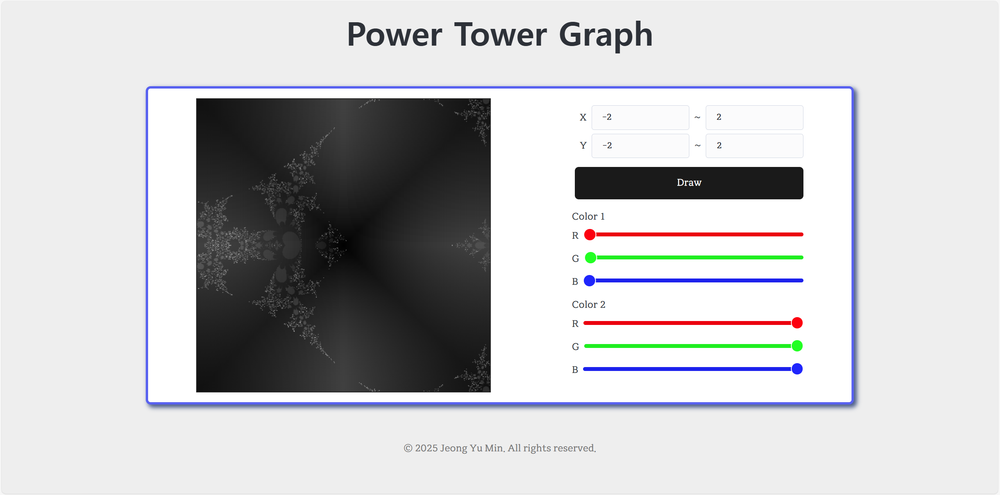
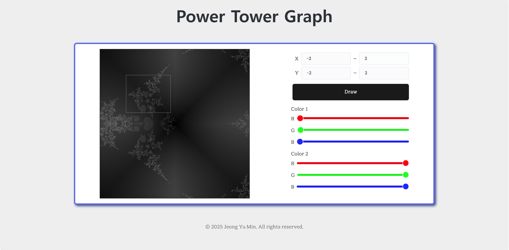
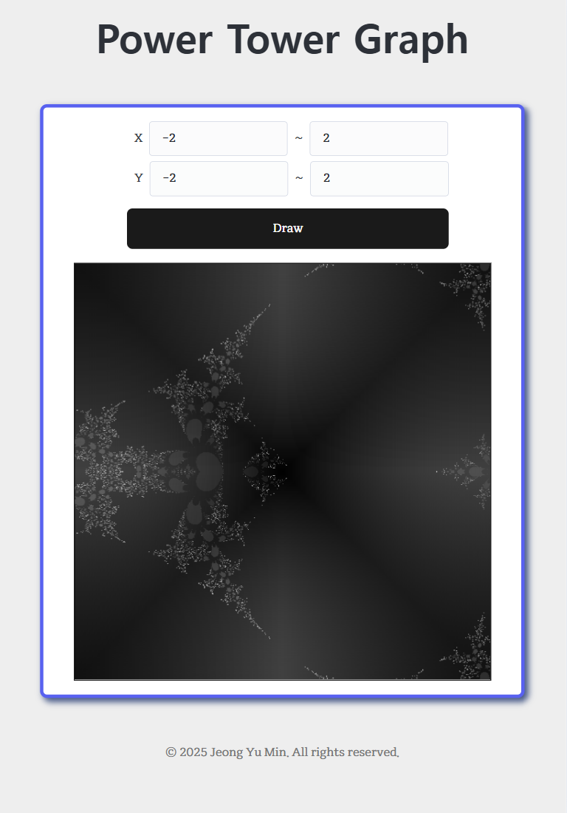

# Power Tower Divergence/Convergence Visualizer

This project is a **client-side only** interactive visualizer that explores the **convergence and divergence** behavior of **power towers** (tetration) across the complex plane.

Built with **React**, **Vite**, and **HTML5 Canvas**.

>***Looking for the full stack version?***
>
>Check out the *[full-stack-branch](https://github.com/jym0404/Power-Tower-Graph/tree/main)*


## 🚀 Features

- 🖼️ 600x600 canvas for displaying the graph.
- 🖱️ Interactive zooming via mouse dragging.
- 🔄 Re-rendering at the current zoom position with a click of a button.
- 🎨 Customizable colors for converging and diverging regions.
- 🌈 Smooth color blending based on the number of iterations before convergence.
- ⚡ Fast client-only performance with no server-side dependencies.


## 📦 Tech Stack

- React
- Vite
- HTML5 Canvas API


## 📷 Screenshot





※ Phones are not supported yet.

## 🛠️ Getting Started

1. Clone the repository  
    ```bash
    git clone --branch client-only https://github.com/jym0404/Power-Tower-Graph
    cd power-tower-graph
    ```

2. Install dependencies  
    ```bash
    npm install
    ```

3. Start development server  
    ```bash
    npm run dev
    ```

4. Open in browser: `http://localhost:5173`


## ⚙️ Customization

You can modify the following:

- Color gradient for convergence/divergence in the UI.
- Iteration depth and convergence threshold in the code.
- Zoom/drag behavior using the canvas handlers.


## 📚 What is a Power Tower?

A power tower is an expression of the form:

```math
x ↑↑ n = x^{x^{x^{\cdots}}}  ← n\ times
```

This visualizer shows how such towers behave across the complex or real plane — whether they converge to a fixed value or diverge to infinity.


## 🤖 AI Acknowledgment

This project was heavily supported by ChatGPT (OpenAI) during development, especially in algorithm design and UI logic.


## 📝 License

This project is open-source under the MIT License.
